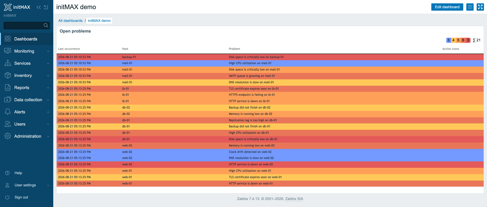
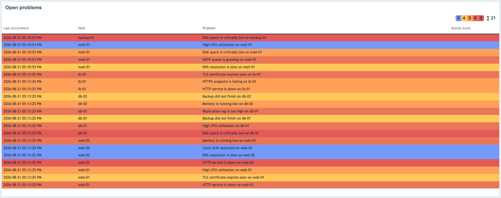
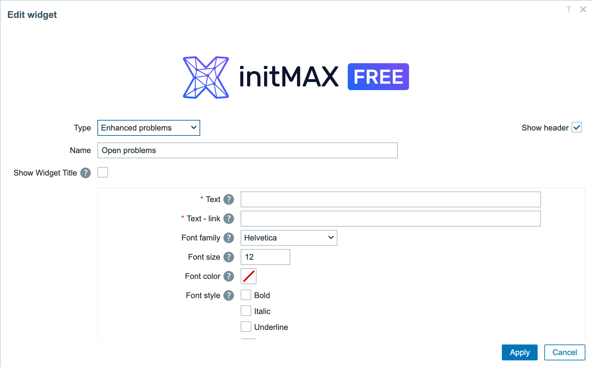
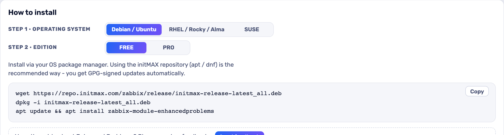

<h1>Enhanced Problems</h1>

developed and maintained by

and community

<strong>The Zabbix Problems widget, with the filtering and layout an operations wall actually needs.</strong> 
Zabbix's own Problems widget shows one list, the same way, for everyone looking at it. Enhanced Problems lets a dashboard say what this particular screen is for: which columns, how large, in what colour, and which problems belong on it at all.

<a href="#what-you-can-build"><strong>Features</strong></a> &nbsp;·&nbsp;
<a href="#examples"><strong>Examples</strong></a> &nbsp;·&nbsp;
<a href="#install"><strong>Install</strong></a> &nbsp;·&nbsp;
<a href="#free-vs-pro"><strong>FREE vs PRO</strong></a> &nbsp;·&nbsp;
<a href="https://portal.initmax.com"><strong>Portal</strong></a> &nbsp;·&nbsp;
<a href="https://www.initmax.com/wiki/enhanced-problems/"><strong>Docs</strong></a>

 

---

## Why Enhanced Problems

A problems list is the one widget that ends up on every wall display, every NOC screen and every team's own dashboard - and each of those wants something different from it. One wants the host column wide and everything else gone; another wants severity counts at a glance from ten metres away; a third wants to acknowledge without leaving the page.

Enhanced Problems is that widget with those decisions handed back to whoever builds the dashboard.

## What you can build

<table>
<tr>
<td width="50%" valign="top">

**Your own column set**

Choose which columns appear and how wide each one is - a problems list that fits the screen it runs on.

</td>
<td width="50%" valign="top">

**Readable from across the room**

Font size and colours are yours to set, made for wall displays.

</td>
</tr>
<tr>
<td width="50%" valign="top">

**Severity summary row**

Problem counts per severity on top of the list.

</td>
<td width="50%" valign="top">

**Acknowledge in place**

Acknowledge a problem straight from the widget, no detour to the Problems page.

</td>
</tr>
<tr>
<td width="50%" valign="top">

**Filter like the stock widget**

Host group, host, severity, tags and problem name.

</td>
<td width="50%" valign="top">

**Three-level sorting**

Sort by severity, then time, then host - or any order you prefer.

</td>
</tr>
</table>

## Examples

<table>
<tr>
<td width="50%" align="center" valign="top"> <small><b>Problems</b> - Nineteen open problems across eight hosts, sorted by severity, with the per-severity counters in the summary row.</small></td>
</tr>
</table>

## Configuration

Everything lives in one familiar widget form.

## Install

**FREE** ships as **GPG-signed `deb` / `rpm` packages** from the initMAX repository - `apt` / `dnf` installs them and keeps them updated.

### Easiest way - the guided installer on the Portal

Open the product page, pick your **OS** and **edition**, and copy the ready-made command. FREE is fully public (no login); PRO fills in your token once you sign in. There's a feedback box right there too.

<a href="https://portal.initmax.com/catalog/zabbix-enhancedproblems#how-to-install"><strong>→ Open the installer on the Portal</strong></a>

Prefer a plain archive? Every release also ships as a **ZIP** [straight from the repo](https://repo.initmax.com/zabbix/free/zip/enhancedproblems/) - handy for offline or manual installs.

The module is enabled automatically during the package installation - verify it in **Administration → General → Modules**. Done.

## FREE vs PRO

There is no paid edition: everything above is in the one package, under AGPLv3.

| Feature | FREE |
| ---------------------------------------------------------- | :----: |
| Choose which columns appear, and how wide each one is | ✅ |
| Font size and colour control, for wall displays read at a distance | ✅ |
| Problem counts by severity | ✅ |
| Acknowledge a problem from the widget itself | ✅ |
| Filter by host group, host, severity, tags and problem name | ✅ |
| One package for Zabbix 6.0 - 7.4 | ✅ |
| Localised into all 25 Zabbix display languages | ✅ |
| High availability ready | ✅ |
| Licence | AGPLv3 |

## Requirements

|              |                                                              |
| ------------ | ------------------------------------------------------------ |
| **Zabbix**   | 6.0 · 6.2 · 6.4 · 7.0 · 7.2 · 7.4 - one package covers all    |
| **PHP**      | 7.4 or newer                                                 |
| **OS**       | Debian/Ubuntu · RHEL/Rocky/Alma/Oracle/Amazon · SUSE         |
| **Editions** | FREE (public repo) - there is no paid edition                  |
| **Languages** | All 25 Zabbix display languages - the widget follows each user's own language setting |
| **High availability** | Ready. No server-side component and no local state; install it on every frontend node of an HA cluster and any node can serve it |

Zabbix accepts one module format below 6.4 and a different one from 6.4 up, so the package carries both and the frontend loads whichever it understands. What a customer configures, and what the widget draws, is the same on every version in that range: the same fields, under the same names, storing the same values - so a dashboard can move across 6.4 in either direction with nothing lost.

**Upgrading from 7.0-1 or earlier.** Below 6.4 that release stored a configuration of its own, and the two halves of the widget could not read each other's dashboards. Your existing widgets are carried over the first time they are opened - columns keep their order, widths and labels, tags you had listed under "Tag display priority" become tag columns, and your font is preserved. Two settings from the old 6.0/6.2 form have no equivalent and are not approximated: **Show tags**, which showed the first one to three tags of a problem whichever they turned out to be (name the tags you want and the widget gives each one a column), and the **description length limit**, which truncated the problem name (set the Problem column's width instead).

## Support &amp; links

- **[Documentation / Wiki](https://www.initmax.com/wiki/enhanced-problems/)**
- **[Product page](https://www.initmax.com/product/enhanced-problems/)**
- **[Portal](https://portal.initmax.com)** - downloads, tokens, support tickets
- **Source code (FREE, AGPLv3)** - included in every package and published as a [source archive](https://repo.initmax.com/zabbix/free/zip/enhancedproblems/) on repo.initmax.com
- **[support@initmax.com](mailto:support@initmax.com)**

---

FREE: <a href="https://www.gnu.org/licenses/agpl-3.0.html">AGPLv3</a> &nbsp;·&nbsp; © 2021-2026 initMAX s.r.o.

